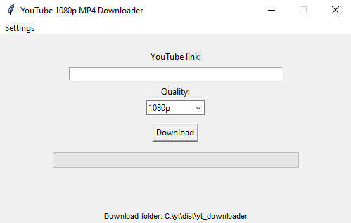

# YouTube 1080p MP4 Downloader

A simple GUI application for downloading YouTube videos in MP4 (H.264) with audio, supporting quality selection (2160p, 1440p, 1080p, etc.), download folder selection, progress bar, and speed display.

## Features
- Download YouTube videos in MP4 (H.264) with audio
- Choose video quality: 2160p, 1440p, 1080p, 720p, 480p, 360p, 240p, 144p
- Select download folder
- Progress bar and download speed display
- Simple and clean interface (Tkinter)
- No AV1 codec, always H.264 for compatibility

## Screenshots
 <!-- Add your screenshot here if available -->

## Requirements
- Python 3.7+
- [yt-dlp](https://github.com/yt-dlp/yt-dlp)
- Tkinter (usually included with Python)

## Installation
1. Clone the repository or download the script:
   ```sh
   git clone https://github.com/yourusername/yt_downloader.git
   cd yt_downloader
   ```
2. Install dependencies:
   ```sh
   pip install yt-dlp
   ```
   (Tkinter is usually included with Python. If not: `pip install tk`)

## Usage
Run the program:
```sh
python yt_downloader.py
```

- Paste a YouTube link
- Select desired quality
- Choose download folder (Settings > Choose download folder)
- Click "Download"
- Watch progress and speed
- The video will be saved in the selected folder as MP4 (H.264)

## Build Windows Executable (.exe)
You can create a Windows executable using PyInstaller.

1. Install PyInstaller:
   ```sh
   pip install pyinstaller
   ```
2. Build (with separate DLLs and files):
   ```sh
   pyinstaller --noconsole yt_downloader.py
   ```
   - The executable and all dependencies will be in `dist/yt_downloader/`.
   - Run `yt_downloader.exe` from that folder.

3. (Optional) Add an icon:
   - Place `icon.ico` in the project folder
   - Build with:
     ```sh
     pyinstaller --noconsole --icon=icon.ico yt_downloader.py
     ```

## Notes
- For best results, use Python 3.8–3.10 (x64) on Windows 10/11.
- If yt-dlp requires ffmpeg, download [ffmpeg.exe](https://www.gyan.dev/ffmpeg/builds/) and place it in the same folder as the executable.
- If you encounter DLL errors, do **not** use `--onefile` mode; use the default mode as described above.

